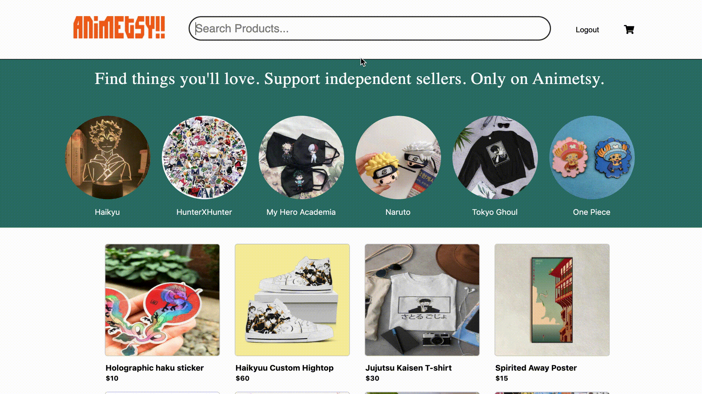
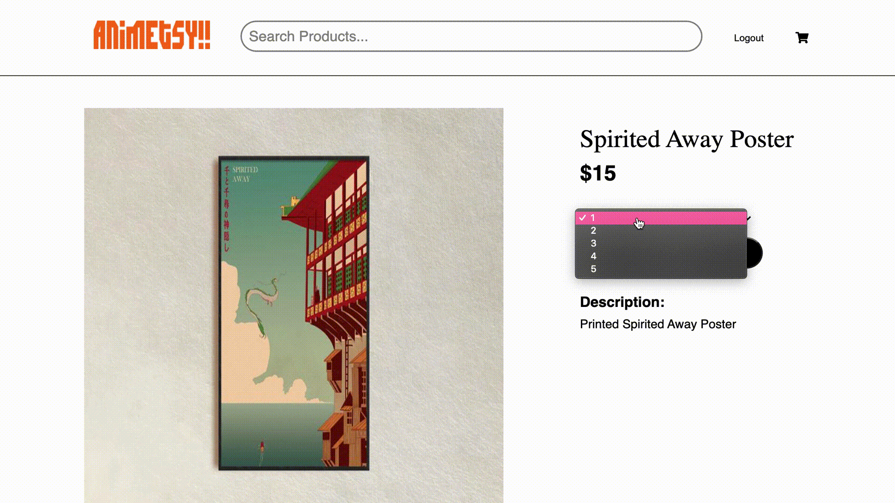

# README


<br/>
<br/>

Animetsy is a fullstack clone of Etsy. Animetsy specifically focuses on the Anime industry and handmade Anime merchendise. On Animetsy you are able to browse and search for different items. You are able to leave reviews and add any item to your own cart.

[Click here to see Animetsy](https://animetsy.herokuapp.com/)

## Technologies
#
* Ruby on Rails
* Javascript
* Raact
* Redux
* HTML
* CSS
* AWS

## Features
#

* One key feature on Animetsy is the Search Bar. This feature allows you to filter through the products on the site according to your preference on what you may be searching for.
<br/>
<br/>



<br/>
<br/>


* Another key feature is the shopping cart. You are able to add multiple items to the cart and change the quantity of the product. When changing the quantity of each product, the total price for each item and the cart total will update accordingly. The user is also able to delete any item from the cart.

<br/>
<br/>



<br/>
<br/>

## Challenges
#

One challenge that I ran into was recieve data from another table from the backend for my reviews. During this time, I was trying to recieve the current user's first name to add to the reviews index page when a review is created. I went back to the backend of reviews and checked the associations. That is when I realized the associations also had to be connected in the views if I wanted to recieve access to the information in the users table.

```
@reviews.each do |review|
    json.set! review.id do 
        json.partial! '/api/reviews/review', review: review 
        json.firstName review.user.first_name

    end
end
```
That is when I was able to retrieve the user's table information in the reviews, for the frontend. 

```
reviews.map(review => {
            return (
                <div className="each-review">
                    <div>
                        <h4 className="review-name">
                            {review.firstName}</h4>
                    </div>
                    <Rating
                        initialRating={review.rating}
                        emptySymbol="far fa-star"
                        fullSymbol="fas fa-star"
                        readonly={true}
                    />
                    
                    <div>
                        {review.body}
                    </div>
                        
                </div>
            
            )})
```